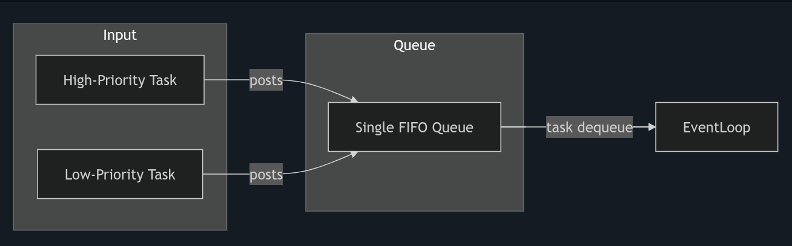
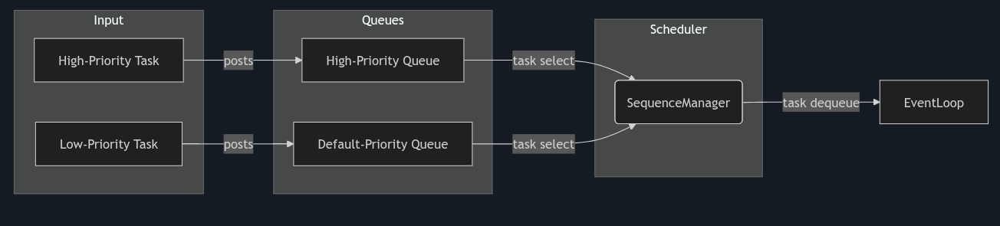
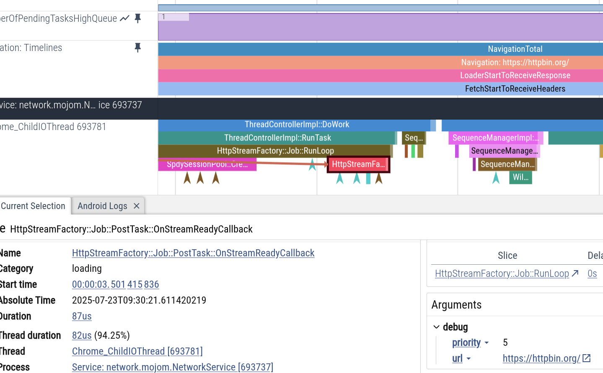
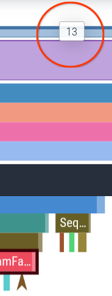
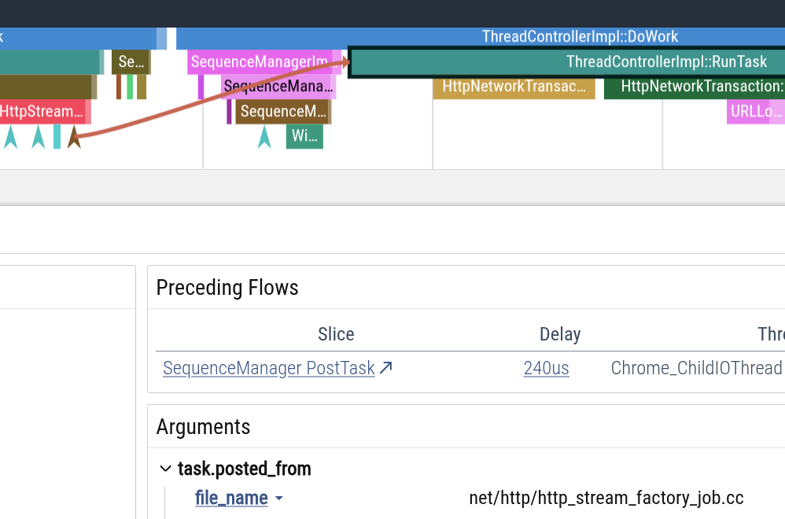

# Introducing the Task Scheduler in Chromium's Network Stack: A 0.3% Improvement in Loading Speed

<!--
date = "2025-12-18"
-->

In the quest for a faster, smoother web browsing experience, every millisecond
counts. At the heart of Chrome's ability to fetch web content is the network
stack, a complex piece of engineering responsible for handling all network
requests. As a software engineer on the Google Chrome networking team, I'm
excited to share a significant improvement I've made to the core of Chromium's
networking: a new Task Scheduler for the Network Service thread, which has
demonstrated an improvement of up to 0.3% in loading speed on global key
metrics.

## Historical Context: From I/O-Bound to CPU-Bound

Historically, Chromium's Network Service thread was designed as a classic
event-driven, I/O-bound system. Its main job was to wait for network events
(like data arriving on a socket) from the kernel and react to them. Tasks were
generally lightweight and processed in a simple First-In, First-Out (FIFO)
queue. This model was efficient when the primary bottleneck was the network
itself.

However, as the web has grown more complex, the network stack's responsibilities
have also expanded. It's no longer just about waiting for data; it now handles
more CPU-intensive tasks like parsing complex proxy rules, managing security
policies, and handling intricate caching logic. This shift meant that a
long-running, CPU-bound task could occupy the thread and prevent it from
processing critical, time-sensitive network I/O, creating a bottleneck right
where we least wanted one.

## The Challenge: A Digital Traffic Jam

The existing FIFO model was a bit like a single-lane road. A CPU-intensive but
low-priority background task could get in front and delay a high-priority
navigation task. This contention could negatively impact key performance metrics
like First Contentful Paint (FCP) and Largest Contentful Paint (LCP), ultimately
leading to a slower page load for the user.

Here is a simplified illustration of the "before" state:

_Figure 1: The previous single-queue approach, where all tasks were processed in
FIFO order._

<!-- ```mermaid -->
<!-- graph LR -->
<!--     subgraph "Input" -->
<!--         HighPriority[High-Priority Task] -->
<!--         LowPriority[Low-Priority Task] -->
<!--     end -->

<!--     subgraph "Queue" -->
<!--         TheQueue[Single FIFO Queue] -->
<!--     end -->

<!--     HighPriority -- posts -\-> TheQueue -->
<!--     LowPriority -- posts -\-> TheQueue -->
<!--     TheQueue -- "task dequeue" -\->  EventLoop -->
<!-- ``` -->



This diagram illustrates this "single-lane highway." Both high-priority and
low-priority tasks are funneled into the same `Single FIFO Queue`. The
`MessagePump`, which is Chromium's core event loop, simply pulls tasks from this
queue in the order they were added. This means a critical navigation task could
get stuck waiting for a less important background task to finish.

## The Solution: A Multi-Lane Highway for Network Tasks

To address this, I introduced an **application-level task scheduler** in the
Network Service. It's important to note that this scheduler operates on top of
the existing event loop. It doesn't change how the kernel notifies us of I/O
events, but it gives us fine-grained control over the order in which our
application's C++ tasks are executed.

The new scheduler replaces the single-lane road with a multi-lane highway,
complete with express lanes for high-priority traffic.

Here is a simplified illustration of the "after" state:

_Figure 2: The new scheduler with prioritized queues, allowing critical tasks to
be processed first._



<!-- ```mermaid -->
<!-- graph LR -->
<!--     subgraph "Input" -->
<!--         HighPriority[High-Priority Task] -->
<!--         LowPriority[Low-Priority Task] -->
<!--     end -->

<!--     subgraph "Queues" -->
<!--         HQ[High-Priority Queue] -->
<!--         DQ[Default-Priority Queue] -->
<!--     end -->

<!--     subgraph "Scheduler" -->
<!--         SM(SequenceManager) -->
<!--     end -->

<!--     HighPriority -- posts -\-> HQ -->
<!--     LowPriority -- posts -\-> DQ -->
<!--     HQ -- "task select" -\-> SM -->
<!--     DQ -- "task select" -\-> SM -->
<!--     SM -- "task dequeue" -\-> EventLoop -->
<!-- ``` -->

This diagram shows the new, improved workflow.
High-priority tasks are now sent to a dedicated `High-Priority Queue`, while
other tasks go to a separate `Default-Priority Queue`. The key addition is the
`SequenceManager`, which acts as an intelligent traffic controller. It actively
pulls tasks from the available queues, always selecting the next available task
from the highest-priority queue. This ensures that critical work can jump to the
front of the line and is no longer delayed by less important tasks.

### From a Single Queue to Prioritized Lanes

At a technical level, `SequenceManager` manages task execution on the Network
Service thread. My first iteration (v1) of the scheduler introduced two task
queues: a `HighPriorityTaskQueue` for critical tasks and a `DefaultTaskQueue`
for everything else. Tasks are categorized based on their existing
`net::RequestPriority`. For example, tasks associated with a user-initiated
navigation are considered `HIGHEST` priority and are routed to our new express
lane.

Building on the success of v1, I've since rolled out v2 of the scheduler, which
is even more granular. It features six task queues, one for each
`net::RequestPriority` level (from `THROTTLED` to `HIGHEST`). This allows for a
much finer-grained control over task prioritization.

## A Real-World Example in Action

To make this more concrete, let's look at a real-world trace of the scheduler in
action. In this scenario ([Perfetto trace](https://ui.perfetto.dev/#!/?s=d4f33e09f0d0633038c5c36cf9892d247b061a04)),
a simple navigation to `https://httpbin.org/` occurred.

When the navigation task (an `HttpStreamFactoryJob` posting an
`OnStreamReadyCallback`) was posted with `HIGHEST` priority (Figure 3), the
default queue already had 13 pending tasks (Figure 4). In a traditional
First-In, First-Out (FIFO) system, this critical navigation task would normally
have to wait for those 13 tasks to complete.

_Figure 3: [00:00:03.501415836] HttpStreamFactoryJob posts a task for
OnStreamReadyCallback with the highest priority using a high-priority task
runner._



_Figure 4: The number of tasks in the default queue._



However, with the new Task Scheduler, the `SequenceManager` immediately
recognized the high-priority task. It processed this newly posted task without
delay, taking precedence over the tasks in the default-priority queue (as
depicted in Figure 5). This bypassing demonstrates how the scheduler ensures
critical user-facing work is not blocked by less important background
operations, leading to a more responsive browsing experience.

_Figure 5: [00:00:03.501727836] The high-priority task is processed immediately,
taking precedence over the tasks in the default-priority queue._



## The Journey: Timeline, Challenges, and Triumphs

Introducing such a fundamental change to a mature and complex codebase like
Chromium's network stack was a significant undertaking.

### The Challenges

One of the biggest risks was the potential for **task reordering** to break
subtle assumptions in the existing code, leading to stability issues like race
conditions or use-after-free bugs. To mitigate this, I took a phased and
data-driven approach. I started with a conservative implementation, focusing on
a small, well-understood set of critical tasks. I then carefully expanded the
scope of the scheduler, continuously monitoring for any regressions. This
meticulous approach, which I documented as "No Mechanical Rewrites" in the
design doc, allowed me to reap the performance benefits without compromising
Chrome's stability.

Another interesting challenge was handling the different ways the Network
Service is run on different platforms. On most desktop platforms, the Network
Service runs in its own dedicated process (out-of-process). However, on some
Android devices, particularly low-end ones, it runs within the main browser
process (in-process) to save memory. This required careful handling to ensure
the scheduler worked flawlessly in both scenarios: its dedicated out-of-process
configuration (standard on desktop) and the in-process, memory-saving
configuration for some Android devices.

### The Timeline

- **Weeks 1-3: Design and Prototyping.** I started by creating a detailed design
  document, outlining the problem, proposed solution, and potential risks. This
  was followed by a proof-of-concept to validate the approach.
- **Weeks 4-9: Integration and Testing.** The next phase involved carefully
  integrating the new scheduler with the existing network stack. This was the
  most extensive part of the work, requiring me to modify numerous task posting
  sites in `//net` and `//services/network`. During this phase, I also added
  comprehensive unit tests and diagnostic metrics to monitor the scheduler's
  behavior.
- **Week 10 onwards: Finch Experiments and Rollout.** With the implementation in
  place, I began a series of Finch experiments on Chrome's Canary, Dev, Beta,
  and Stable channels to measure the real-world impact of the new scheduler.

## The Impact: Measurable Performance Gains

I rigorously tested the new task scheduler through a series of Finch
experiments. The results have been very promising. With the v1 scheduler, I
observed:

- **Up to 0.3% improvement in Global First Contentful Paint (FCP) and Largest
  Contentful Paint (LCP) on Android.** (FCP measures the time it takes for the
  first piece of content to appear on screen, and LCP measures when the main
  content of a page has loaded.)

These seemingly small percentages translate to a noticeably faster and smoother
browsing experience for millions of users, especially on devices with limited
resources or on congested networks.

## What's Next?

The rollout of our v2 per-priority task queues is ongoing, and I'm continuing to
monitor its impact. I'm also exploring other opportunities to improve task
scheduling in the network service, such as dynamically changing task priorities
and allowing tasks to yield to higher-priority ones.

I'm excited about the improvements the new task scheduler brings to Chrome's
performance, and I'll continue to work on making the web a faster place for
everyone.
